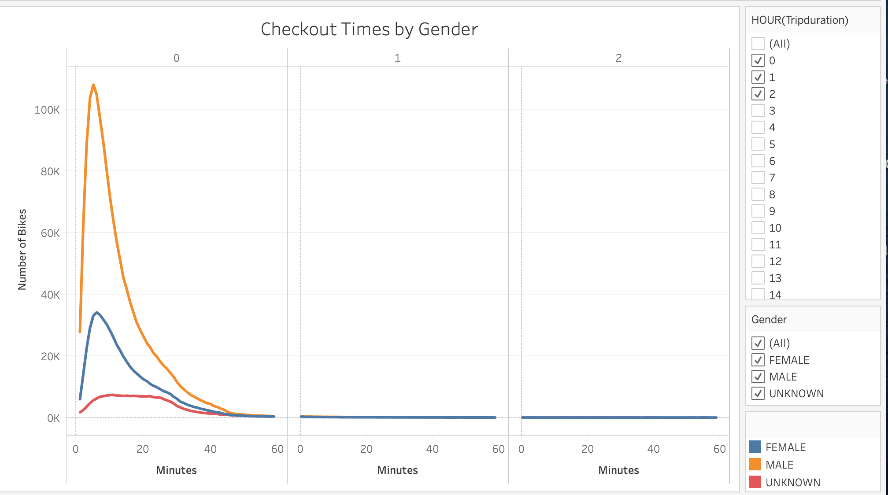

# Overview of the analysis

= The purpose for this analysis is to examine the CitiBike data from August 2019 to assist Des Moines with her business proposal.To solidify the proposal, one of the key stakeholders would like to see a bike trip analysis.

= In the image "Checkout Times for Users" it shows the duration of the bike trips in minutes. The majority of trips are under 20 minutes, and it most significant volume is of trips is 5 minutes.

- In the picture "Checkout Times By Gender" shows the span of bicycle trips by sexual orientation in minutes. Most of excursions are as yet under 20 minutes and with its top at around 5 minutes lengths. Be that as it may, shows male are most basic client of bicycles than females.

- The picture "Trips by Weekday Per Hour" shows the quantity of bicycles utilized during the non-weekend days of great importance. The morning times of heavy traffic are between 7 am and 9 pm. The pinnacle hour is 8 am. The evening busy times are between 4 pm and 7 pm, with the evening top hours are 5 pm and 6 pm.

- The picture "Trips By Gender (Weekday Per Hour)" shows the quantity of bicycles utilized during the work days of great importance by sexual orientation. During the morning and evening times of heavy traffic, male bikers are right around multiple times more than female bikers. For instance, Thursday morning top hours for females is 9,740 and for male Thursdays morning top hours is 25,694.

- The picture "Client Trips By Gender By Weekday" shows what sort of client utilizes the bicycle share program on anytime, supporters and clients. Supporters are returning clients, and clients are arranged as single ride clients. More clients recognizing as either guys or females are endorsers, while most clients under the client classifications are recorded as sexual orientation obscure. Female bicycle endorsers are least well known on Wednesdays. Male bicycle endorsers are generally well known on Thursdays, yet most days have high utilization for male supporters all in all. For clients, the most noteworthy bicycle use time is on Saturdays and Sundays.

## Summary

= Since the outing term for bicycle use is under 20 minutes that is be protected to accept to put bicycle stations around 20 minutes separated from one another. Another idea is to attempt to track down a motivating force to acquire more female bikers since female biker use is low contrasted with guys. Likewise, it is protected to investigate security safety measures for bikers around there. 

For future ideas, two extra perceptions is incorporate the age gathering and sort out which are the top bicycle stations in NYC.
